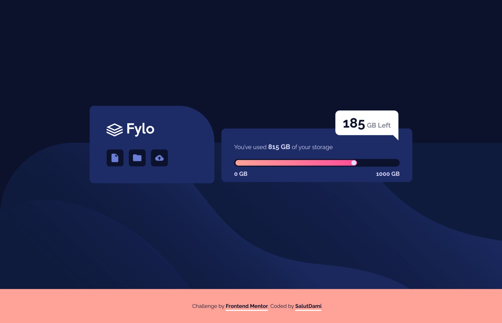
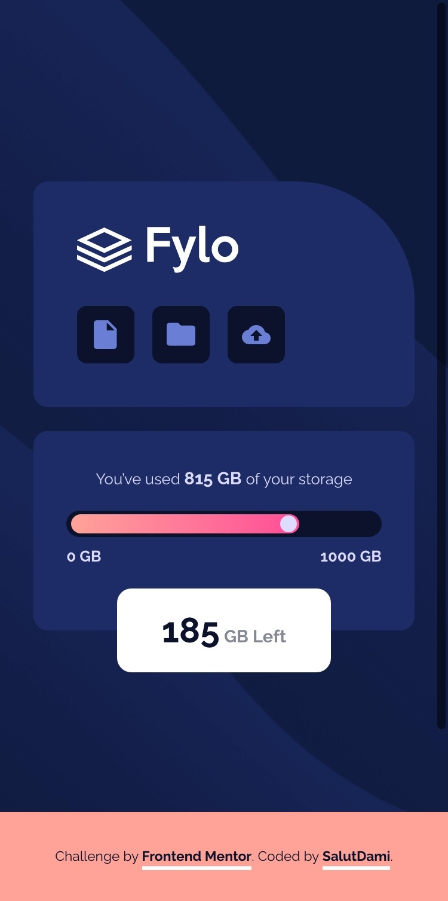

## Table of contents

- [Overview](#overview)
  - [The challenge](#the-challenge)
  - [Screenshot](#screenshot)
  - [Links](#links)
- [My process](#my-process)
  - [Built with](#built-with)
  - [What I learned](#what-i-learned)
  - [Continued development](#continued-development)
  - [Useful resources](#useful-resources)
- [Author](#author)
- [Acknowledgments](#acknowledgments)

## Overview

### The challenge

Users will be able to:

- View the optimal layout for the site depending on their device's screen size

### Screenshot



_A desktop view of the design_



_A mobile view of the design_

### Links

- Solution URL: [Add solution URL here](https://github.com/stephenikuomola/fylo-data-storage-component)
- Live Site URL: [Add live site URL here](https://stephenikuomola.github.io/fylo-data-storage-component/)

## My process

### Built with

- Semantic HTML5 markup
- CSS custom properties
- Flexbox
- CSS Grid
- Mobile-first workflow

### What I learned

This was really challenging as this teted my CSS skills. Working with dimensions was also very good as I got to see how they work and how you can interchange between persentages and rem units as well as pixels. I also got to use the psseudo class and elements.

More understanding of positioning was also achieved here. Some snippets are found below;

```css
.box_two {
  background-color: var(--dark-blue);
  width: 85%;
  max-width: 54.2rem;
  padding-left: var(--space-5);
  padding-right: var(--space-5);
  padding-top: var(--space-5);
  padding-bottom: var(--space-6);
  border-radius: var(--radius-6);
  position: relative;
}

.storage_amount_remained {
  background-color: var(--white);
  height: 7rem;
  width: 17.9rem;
  border-radius: var(--radius-6);
  display: flex;
  align-items: center;
  justify-content: center;
  margin: 0 auto;
  position: absolute;
  bottom: 0px;
  left: 50%;
  transform: translate(-50%, 50%);
}
```

### Useful resources

- [codeconvey](https://codeconvey.com/css-message-box-with-arrow/) - This webiste helped with the message box witth the arrow at the bottom so I would recommend this resouce if you beed to know how to to that.
- [w3school](https://www.w3schools.com) - Another website that helped witgh styling the progress bar of the storage component and I woukd recommend this for any one that wishes to learn how to do that.

## Author

- Twitter - [@\_salutDami](https://www.twitter.com/stephenikuomola)
- Linkedin- [Ikuomola Stephen](https://www.linkedin.com/in/ikuomola-stephen/)
- Frontend Mentor - [@salutDami](https://www.frontendmentor.io/profile/stephenikuomola)
